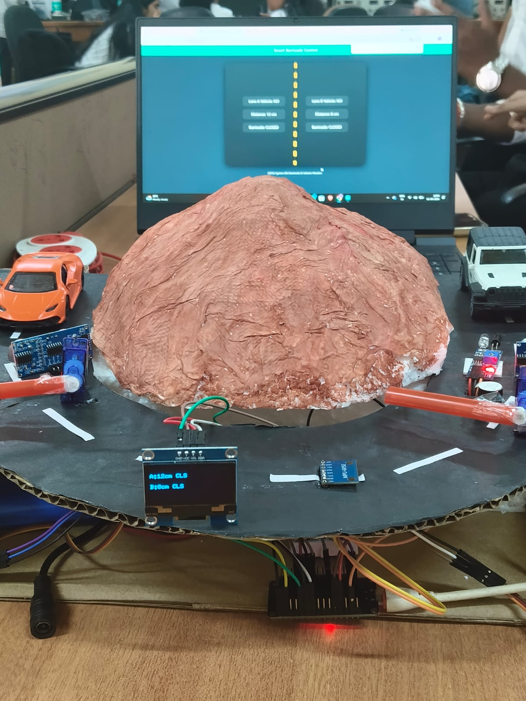
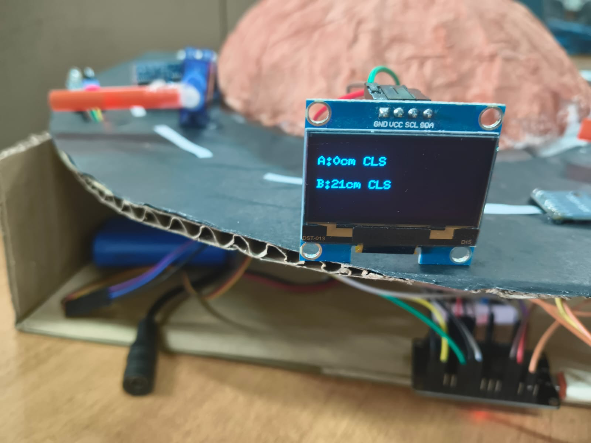
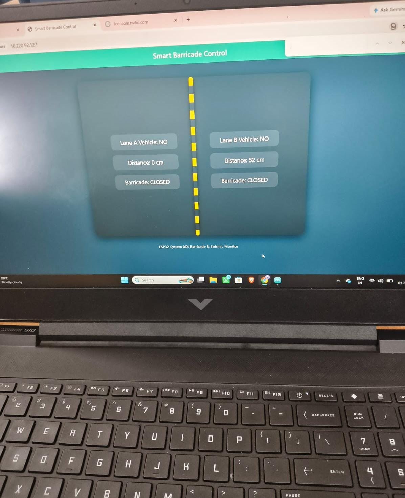
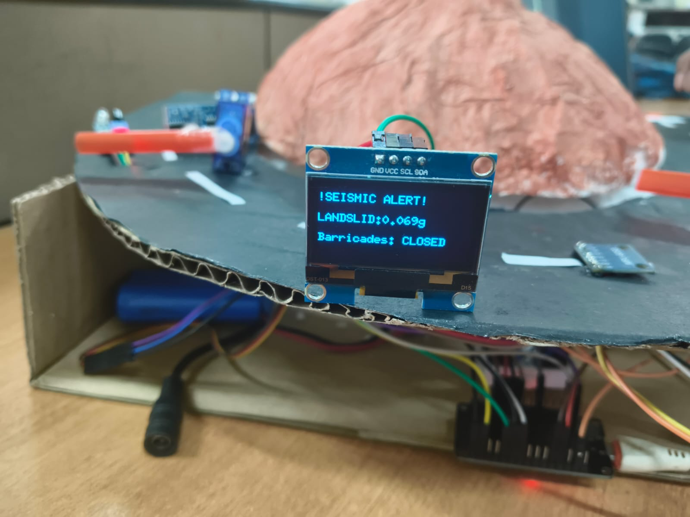

# 🚧 Collision Prevention and Landslide Detection System

An **IoT-based safety system** built using **ESP32** that combines automatic vehicle collision prevention with landslide detection and emergency barricade control.

The system uses **IR sensors** for vehicle detection, **ultrasonic sensors** for distance measurement, **servo motors** for automatic barricade control, and an **MPU6050 accelerometer** to detect abnormal movement and tilt associated with potential landslide events.

During a detected landslide event, the system automatically closes both barricades, activates audible alerts, displays the warning on an OLED, and sends an emergency WhatsApp notification through Twilio.


## 📸 Project Output

### 🔧 Hardware Setup

<!-- ADD HARDWARE IMAGE HERE -->




### 🖥️ OLED Display

<!-- ADD OLED OUTPUT IMAGE HERE -->




### 🌐 Web Dashboard

<!-- ADD WEB DASHBOARD IMAGE HERE -->




### ⚠️ Landslide Detection

<!-- ADD LANDSLIDE DETECTION OUTPUT IMAGE HERE -->




## 🎯 Objectives

- Prevent possible vehicle collisions on a two-lane road.
- Detect vehicles approaching each lane.
- Measure the distance of vehicles from the barricade.
- Automatically control road barricades using servo motors.
- Detect abnormal movement and tilt using the MPU6050.
- Identify potential landslide events based on sensor readings.
- Automatically close both barricades during a detected landslide event.
- Provide audible warnings using buzzers.
- Display system status and emergency alerts on an OLED display.
- Provide a real-time monitoring dashboard through the ESP32.
- Send emergency notifications through WhatsApp.


## ⚙️ System Overview

The system operates mainly in two modes:

### 1. Collision Prevention Mode

During normal operation:

- IR sensors detect vehicles in Lane A and Lane B.
- Ultrasonic sensors measure the distance of approaching vehicles.
- The ESP32 controls the barricades based on vehicle presence.
- Only the required lane is opened while the other lane remains closed.
- When vehicles are detected in both lanes, the system manages access alternately.
- Buzzers provide warnings based on the distance of the vehicle from the barricade.
- The OLED displays lane distance and barricade status.
- The web dashboard provides real-time system information.


### 2. Landslide Detection Mode

The MPU6050 continuously monitors acceleration and tilt.

When abnormal movement or significant tilt is detected:

1. A landslide event is detected.
2. Both barricades are immediately closed.
3. Audible alerts are activated.
4. The OLED displays a seismic/landslide warning.
5. The web dashboard displays the detected event.
6. A WhatsApp emergency notification is sent through Twilio.
7. The barricades remain closed until the event conditions have cleared.


## 🧠 Working Principle

```text
                    ┌─────────────────┐
                    │      ESP32      │
                    │  Main Controller│
                    └────────┬────────┘
                             │
          ┌──────────────────┼──────────────────┐
          │                  │                  │
          ▼                  ▼                  ▼
    IR Sensors        Ultrasonic Sensors      MPU6050
   Vehicle Detection  Distance Measurement   Tilt/Movement
          │                  │                  │
          └──────────────────┼──────────────────┘
                             │
                             ▼
                    ┌─────────────────┐
                    │ Decision Making │
                    └────────┬────────┘
                             │
             ┌───────────────┴───────────────┐
             │                               │
             ▼                               ▼
     Normal Operation                 Landslide Detected
             │                               │
             ▼                               ▼
      Servo Barricades               Close Both Barricades
             │                               │
             ▼                               ├──► Buzzer Alert
      Collision Prevention                 ├──► OLED Alert
                                           ├──► Web Dashboard
                                           └──► WhatsApp Alert
